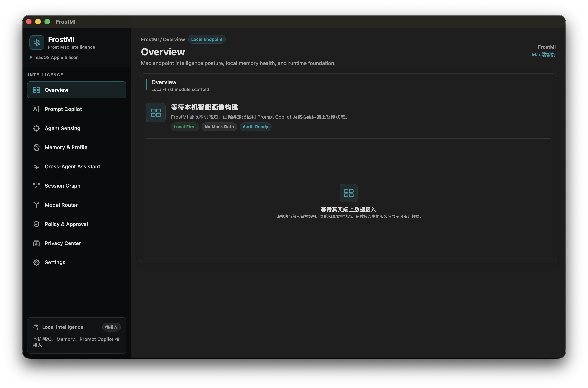

# Frost Mac Intelligence (FrostMI)


**Frost Mac Intelligence** (**FrostMI**, 中文名：**Frost Mac端智能**) is a macOS Apple Silicon endpoint-native intelligence platform for local AI agents, user workflows, evidence-bound memory, Prompt Copilot, and cross-agent assistance.

FrostMI 不再只是一个安全控制台。它站在 Mac 端上系统层，感知 Claude Code、Cursor、Codex CLI、Gemini CLI、Cline、Continue、OpenClaw、Aider、MCP、Skills 和企业自研 Agent 的真实行为，把可观察行为沉淀为可审计本地记忆，并用这些记忆帮助用户写出更好的 Prompt、理解跨 Agent 工作流、做出更可靠的决策。

`FrostADR` 仍然保留为 FrostMI 内部的 **Agent Runtime & ADR foundation**，用于承载发现、检测、审计、策略、审批和响应能力。用户侧产品、UI、README 和主应用命名统一使用 **FrostMI**。

## Screenshot



## Quick Links / 快速跳转

- [中文界面导览](#中文界面导览)
- [English Interface Tour](#english-interface-tour)
- [Current Capabilities](#current-capabilities)
- [Launch The macOS App](#launch-the-macos-app)
- [Discovery Validation](#discovery-validation)
- [Roadmap](#roadmap)

## 中文界面导览

FrostMI 当前界面围绕 Mac 本机 AI Agent 的端上感知展开。主界面以 **Agent Sensing** 为核心入口，展示本机 Agent、MCP Server、Skills、Context、Memory 和权限状态，并支持重新构建画像、分页查看、点击定位文件路径、导出 JSONL 以及在 Finder 中打开相关资产。Codex CLI 与 Codex App 会作为不同的本机 Agent 形态分别识别，避免桌面 UI 被 CLI 指纹吞并。

| 界面区域 | 当前作用 |
| --- | --- |
| Overview | FrostMI 端上智能的总览入口，后续承载端上画像、记忆与风险态势。 |
| Prompt Copilot | 规划中的 Prompt 增强入口，用于基于本地证据生成建议。 |
| Agent Sensing | 当前已实现的真实发现模块，发现 Claude Code、Cursor、Codex CLI、Gemini CLI、MCP、Skills、Context 和 Memory。 |
| Memory & Profile | 规划中的本地证据记忆与用户/项目/Agent 画像入口。 |
| Cross-Agent Assistant | 规划中的跨 Agent 本地问答与工作流解释入口。 |
| Session Graph | 规划中的可观察决策链与执行链重建视图。 |
| Model Router | 规划中的本地/外部模型路由与隐私控制入口。 |
| Policy & Approval | FrostADR Runtime 的策略、审批与响应能力入口。 |
| Privacy Center | 本地优先、数据上传与隐私边界控制入口。 |
| Settings | 本地配置、保护模式和后续运行时组件设置入口。 |

## English Interface Tour

The current FrostMI interface is centered on endpoint-native sensing for local AI agents on macOS. The primary implemented module is **Agent Sensing**, which discovers local Agents, MCP servers, Skills, Context files, Memory assets, and permission states. Users can rebuild the local agent profile, browse paginated inventories, click asset paths to reveal them in Finder, and export JSONL for local audit/debug workflows. Codex CLI and Codex App are detected as separate local agent surfaces so the desktop UI is not collapsed into the CLI fingerprint.

| Area | Current Role |
| --- | --- |
| Overview | Entry point for the endpoint intelligence summary, future memory profile, and risk posture. |
| Prompt Copilot | Planned prompt-assist surface powered by local evidence and auditable context blocks. |
| Agent Sensing | Implemented real discovery module for Claude Code, Cursor, Codex CLI, Gemini CLI, MCP, Skills, Context, and Memory. |
| Memory & Profile | Planned local evidence memory plus user/project/agent profile compiler. |
| Cross-Agent Assistant | Planned local assistant for cross-agent questions and workflow explanations. |
| Session Graph | Planned observable decision/execution chain reconstruction view. |
| Model Router | Planned local/external model routing with privacy controls. |
| Policy & Approval | FrostADR Runtime surface for policy, approval, and response workflows. |
| Privacy Center | Local-first privacy, upload, and trust-boundary controls. |
| Settings | Local configuration, protection mode, and runtime component settings. |

## Core Positioning

- **Sensing is the foundation:** observe local AI agents, MCP configs, skills, context, memory, processes, files, and runtime candidates.
- **Memory is the center:** compile evidence-bound local memory, user profiles, project profiles, agent usage profiles, and workflow profiles.
- **Prompt Copilot is the entry point:** suggest prompt completions, rewrites, Frost Context Blocks, and risk hints without silently rewriting user intent.
- **Local assistant is the interaction layer:** answer cross-agent questions using local evidence, memory, profiles, session graphs, and audit trails.
- **Security remains the foundation:** FrostADR Runtime prevents prompt enhancement from bypassing policy, approval, privacy, or trust boundaries.

## Current Capabilities

- macOS SwiftUI app renamed and packaged as `FrostMI.app`.
- Multi-module endpoint intelligence shell:
  - Overview
  - Prompt Copilot
  - Agent Sensing
  - Memory & Profile
  - Cross-Agent Assistant
  - Session Graph
  - Model Router
  - Policy & Approval
  - Privacy Center
  - Settings
- Real local Agent Discovery in Agent Sensing, including separate Codex CLI and Codex App recognition.
- Known Agent and custom Agent grouping.
- MCP server config discovery without executing MCP server commands.
- Skill discovery and lightweight pre-scan signals.
- Context and Memory metadata discovery.
- Fixed 10-row pagination across inventory and runtime status modules.
- Finder path reveal for Agent, MCP, Skill, Context, and Memory assets.
- Local JSONL export with Finder reveal.
- Default local-first, no-exec, minimum-permission discovery flow.

## Search Keywords

`Frost Mac Intelligence`, `FrostMI`, `Mac endpoint intelligence`, `AI agent intelligence`, `AI agent security`, `Prompt Copilot`, `cross-agent memory`, `local AI memory`, `evidence-bound memory`, `agent discovery`, `agent inventory`, `MCP security`, `Model Context Protocol`, `Skill scanner`, `prompt enhancement`, `prompt injection detection`, `LLM security`, `local-first AI`, `macOS AI assistant`, `SwiftUI macOS app`, `FrostADR Runtime`, `Agent Detection and Response`.

## Recommended GitHub Topics

For repository discovery, add these topics in GitHub's **About** sidebar:

`frostmi`, `mac-intelligence`, `ai-agent-intelligence`, `prompt-copilot`, `local-ai-memory`, `cross-agent-assistant`, `endpoint-intelligence`, `ai-agent-security`, `agent-discovery`, `mcp-security`, `model-context-protocol`, `llm-security`, `macos-security`, `swiftui`, `apple-silicon`, `local-first`, `agent-inventory`, `skill-scanner`, `jsonl`, `frostadr-runtime`.

Suggested repository description:

> Frost Mac Intelligence (FrostMI): local-first macOS endpoint intelligence for AI agents, Agent Sensing, MCP/Skill discovery, evidence-bound memory, Prompt Copilot, and FrostADR Runtime.

See [GitHub SEO Checklist](docs/github-seo.md) for About sidebar, social preview, release title, and keyword maintenance notes.

## Architecture Direction

FrostMI is designed as an endpoint-first product:

- **UI:** macOS SwiftUI app plus future NSPanel Prompt Copilot.
- **Sensing:** known path fingerprints, config schema parsing, workspace scanning, process fingerprints, FSEvents, and runtime observation.
- **FrostADR Runtime:** local discovery, policy, detection, approval, audit, and response foundation.
- **Knowledge Store:** SQLite, FTS5, and future embedded vector retrieval for local memory and profile compilation.
- **Prompt Intelligence:** suggestion-first prompt enhancement with auditable Frost Context Blocks.
- **Model Router:** replaceable provider interface for local models, OpenAI-compatible providers, DeepSeek, and future Apple Foundation Models.
- **Export:** JSONL for debug, audit, and portability.

## Discovery Validation

Run the discovery self-test and bundled app resource check:

```bash
Scripts/run_discovery_tests.sh
```

The script runs Agent Discovery self-tests, builds `dist/FrostMI.app`, verifies bundled fingerprint resources, and runs self-tests through the packaged app. Current checks cover MCP config detection and false-positive control, Codex plugin MCP discovery, known agent fingerprints, targeted home/support-directory discovery, workspace scanning, Skill script signals, discovery source markers, cold-start snapshot replacement, JSONL export integrity, path resolver behavior, and minimum-permission boundaries.

For local discovery debugging, run:

```bash
swift run FrostMI --discovery-print-summary
```

## Launch The macOS App

For the easiest local preview, double-click `FrostMI.command` in Finder. It builds a debug app bundle at `dist/FrostMI.app` and opens it.

From Terminal, run:

```bash
./FrostMI.command
```

To build a release app bundle for local use, double-click `PackageFrostMI.command` or run:

```bash
./PackageFrostMI.command
```

The reusable build script is:

```bash
Scripts/build_app.sh --debug --open
Scripts/build_app.sh --release
```

Generated build output lives under `dist/` and is intentionally not committed.

## Roadmap

- Prompt Copilot floating panel with global shortcut, focused-app detection, selected text extraction, copy / insert / accept / reject, and feedback logging.
- Evidence-bound Memory System with typed memories, origin trust, allowed use, disallowed use, and poisoning risk.
- Profile Compiler for user, project, agent, workflow, and security profiles.
- Cross-Agent Assistant grounded in local SQL, FTS, vector retrieval, and session graph traversal.
- Model Router with local and external providers behind a privacy-preserving interface.
- Session Graph reconstruction from observable prompts, tools, commands, files, network, and memory writes.
- FrostADR Runtime policy, approval, rewrite, block, audit, and response workflows.

## Status

FrostMI is an early-stage macOS endpoint intelligence project. The current app focuses on the multi-module product shell and real Agent Sensing / Discovery foundation. Prompt Copilot, Memory/Profile, Assistant, Model Router, full Endpoint Security integration, Network Extension enforcement, MCP wrapping, and Local LLM Proxy features are planned but not yet production-ready.

If this direction is useful to you, please Star the repository so more Mac AI, agent intelligence, and endpoint security builders can find it.
